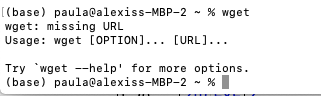
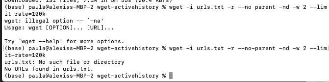
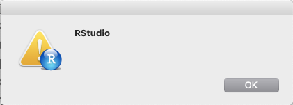
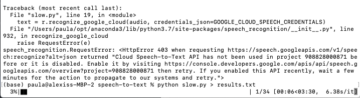
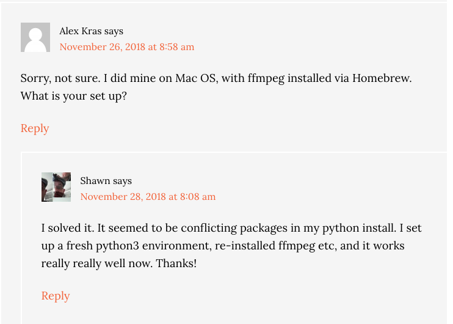
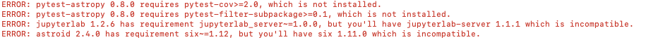

# Week Two notes

## getting started with Sublime
- easy installation, no errors

## getting started with Anaconda
- no worries installing and running

## getting started with Wget
- ran into an error message when downloading the first file from archivehistory.ca 
- when I looked up the error message, I got to [this page](https://stackoverflow.com/questions/33494067/lfs-version-7-8-wget-is-not-working) and I realized that I was not working in the correct directory
- changed the directory and everything worked
- no error messages when downloading multiple files from archivehistory.ca but it was taking a while, so I was worried that I was downloading more than what was instructed, but it finished and didn't look like too many files
- discussion in the Week Two text channel of the Discord server showed that others had the same concern, and it also took them over 15 minutes to download the papers
- I wonder if there is any way to stop the downloading process in case we do end up accidentally asking for more than we meant to?
- ran into an error message when trying to download the urls from urls.txt. at first I thought it was because I forgot a dash in the command, but when I fixed it, I was still getting an error: 
- googled the error message and used [this link](https://stackoverflow.com/questions/33494067/lfs-version-7-8-wget-is-not-working) and [this one](https://askubuntu.com/questions/1190692/error-when-using-wget-to-download-a-list-of-urls-in-a-txt-file) to discover that I didn't save urls.txt into the wget-archivehistory directory. So, I changed my working directory to the correct one where my txt file was saved and input the command again, which worked!

## APIs
- worked well, no errors
- still need to get used to syntax and how to find out how APIs are formatted for different websites, which I suppose will just come with continued use and practice

## OCR
- downloaded R studio from Anaconda Navigator, but when I tried to launch it I got this blank error message: 
- googled the problem and got to [this site](https://community.rstudio.com/t/r-does-not-launch-properly/8630/2)
- uninstalled Rstudio from Anaconda Navigator and downloaded directly onto my computer, following the instructions from the website
- followed the OCR exercise instructions from Week Two and everything worked 

## bonus exercise
- no problems working with Google Console and setting up
- ran into an error when breaking up the file into 30 second clips: 
- realized that it was because I didn't have a "parts" directory where the segements were supposed to save
- created a "parts" directory and it worked :)
- got another error message when it was time to create the transcription: 
- followed the instructions and enabled the Google API for the project, but I was still getting the error message: `ValueError: Audio file could not be read as PCM WAV, AIFF/AIFF-C, or Native FLAC; check if file is corrupted or in another format`
- saw @cocochantal on discord had the same error as me and found [Dr. Graham's solution](https://www.alexkras.com/transcribing-audio-file-to-text-with-google-cloud-speech-api-and-python/) to the problem two years ago: 
- found [this youtube video](https://www.youtube.com/watch?v=EGaw6VXV3GI) about managing Anaconda environments and used it to deactive the current environment I was in then followed week two instructions to make a new environment
- tried to redownload the requirements.txt info but I got these error messages: 
- looked up the error messages on google and downloaded the things I was missing through these websites: [pytest-astropy](https://pypi.org/project/pytest-astropy/), [pytest-filter-subpackage](https://pypi.org/project/pytest-filter-subpackage/), [jupyterlab-server](https://pypi.org/project/jupyterlab-server/), [six](https://pypi.org/project/six/#description)
- continued to follow the instructions and it worked !

### commandline prompts
- `pwd`: to see the working directory
- `ls`: list files (to see what's inside a folder)
- `cd subfolder`: to change directories
- `cd ..`: to go back up a level
- `mkdir`: make a directory
- `-r`: recursive (recursive links)
- `-np`: no-parent (follow links that lead to destinations insie the folder)
- `-l`: links beyond domain we started in
- `-w`: wait time between requests to the server
- `--limit-rate`: limit bandwidth for request (slows down the time it takes to perform the request)
### new terms
- __API__: Application Programing Interface; instead of an interface meant for a human to interact with the machine, there’s an API to allow some other machine to interact with this one
- __OCR__: Object Chapter Recognition; technique that looks at the pattern of light and dark pixels in an image and matches them against the alphabet
- __collections as data__: mapping the sources themselves can give us historical data
